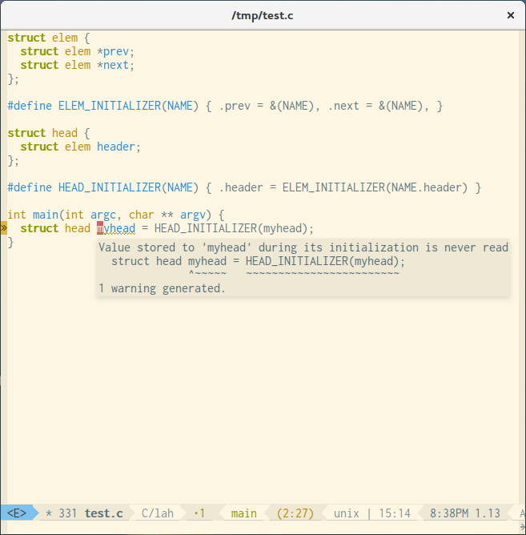

# Flycheck Clang Analyzer Checker

[](http://www.gnu.org/licenses/gpl-3.0.txt)
[](http://melpa.org/#/flycheck-clang-analyzer)
[](https://travis-ci.org/alexmurray/flycheck-clang-analyzer)

Integrate [Clang Static Analyzer](https://clang-analyzer.llvm.org/)
with [flycheck](http://www.flycheck.org) to automatically check for defects in
your code on-the-fly.



This package depends on
either [irony-mode](https://github.com/Sarcasm/irony-mode/)
or [rtags](https://github.com/Andersbakken/rtags) to provide the clang
configuration - and so requires zero extra setup. This checker also
automatically chain itself as the next `flycheck` checker after
both [flycheck-irony](https://github.com/Sarcasm/flycheck-irony/)
and [flycheck-rtags](https://github.com/Andersbakken/rtags) so that it only
runs when the corresponding backend checker returns without warnings. This
avoids trying to perform the analysis when there are syntactic errors in the
current buffer.

## Installation

### MELPA (coming soon...)

The preferred way to install `flycheck-clang-analyzer` is via
[MELPA](http://melpa.org) - then you can just <kbd>M-x package-install RET
flycheck-clang-analyzer RET</kbd>

To enable then simply add the following to your init file:

```emacs-lisp
(with-eval-after-load 'flycheck
  (require 'flycheck-clang-analyzer)
  (flycheck-clang-analyzer-setup))
```

### Manual

If you would like to install the package manually, download or clone it and
place within Emacs' `load-path`, then you can require it in your init file like
this:

```emacs-lisp
(require 'flycheck-clang-analyzer)
(flycheck-clang-analyzer-setup)
```

NOTE: This will also require the manual installation of `flycheck` and
`irony-mode` if you have not done so already.

## License

Copyright © 2017 Alex Murray

Distributed under GNU GPL, version 3.
